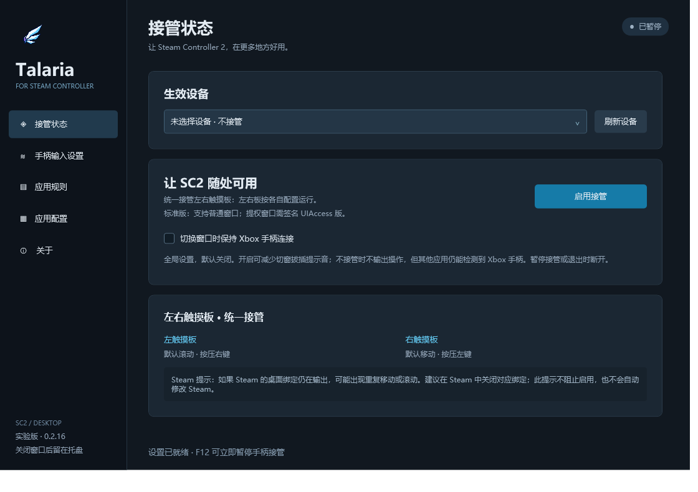
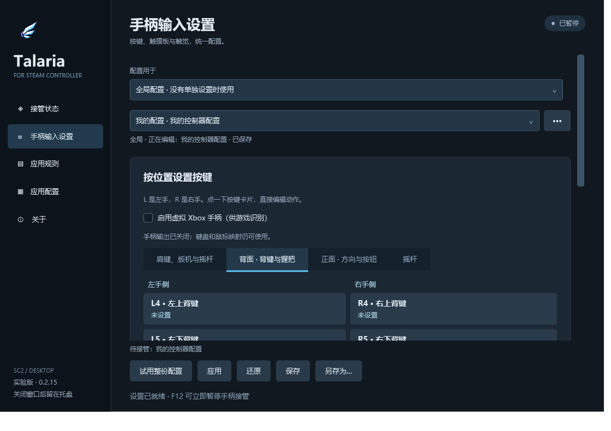
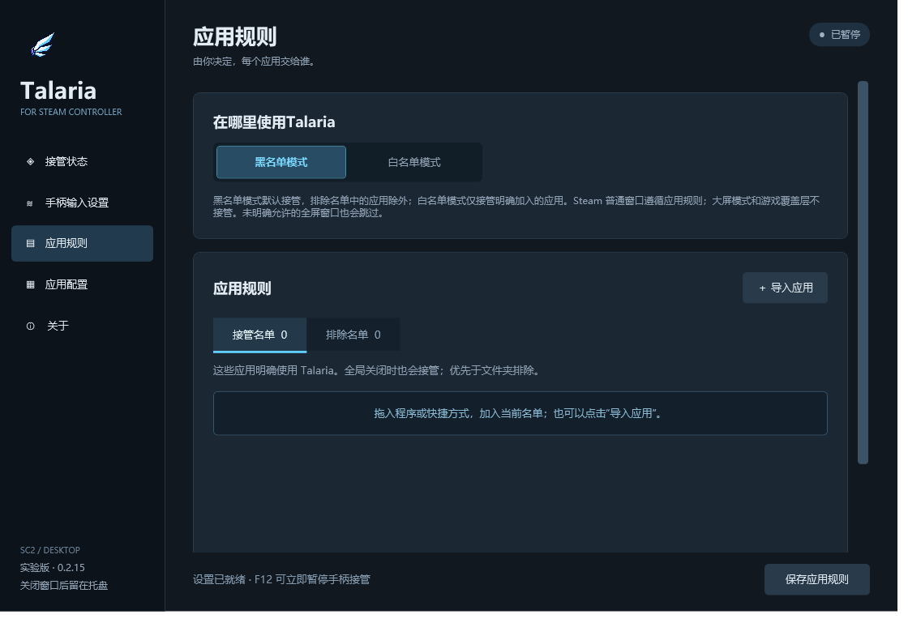
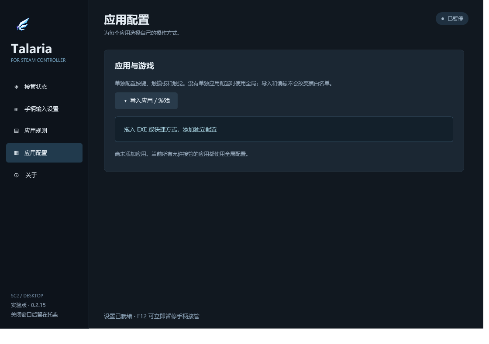

<div align="center">
  
  <h1>Talaria · Steam Controller 工具</h1>
  <p>让 Steam Controller 2 在更多地方用得上，也用得顺手。</p>

[](https://github.com/csvwolf/talaria/actions/workflows/windows.yml)
[](https://github.com/csvwolf/talaria/releases)
[](https://github.com/csvwolf/talaria/releases)
[](LICENSE)
[](#安装与使用)

**简体中文 · [English](README.en.md)**

**[下载安装程序](https://github.com/csvwolf/talaria/releases) · [使用说明](#安装与使用) · [常见问题 / FAQ](docs/faq.md) · [反馈问题](https://github.com/csvwolf/talaria/issues)**

</div>

Windows 上的控制器输入配置工具：全局与单独应用配置、左右触摸板、键鼠映射、组合快捷键、宏、屏幕键盘，以及可选 Xbox 虚拟手柄输出。独立开发项目，与 Valve 无隶属关系。

**支持 Steam Controller 2 的蓝牙、USB 和 Puck／接收器连接。** 触觉反馈与录制目前仅支持蓝牙；USB／接收器支持输入映射与虚拟 Xbox 输出。Steam Deck／Moonlight 转发设备不接管。

## 界面预览

以下为实际程序界面，使用默认配置展示；支持简体中文与 English。

**接管状态** — 选择设备，启用或暂停手柄接管。



**手柄输入设置** — 按位置选择按键，编辑映射并试用、应用或保存配置；同页可配置触摸板与触觉。



**应用规则** — 切换黑白名单模式，点击或拖拽导入应用。



**应用配置** — 为应用或游戏建立独立的按键、触摸板与触觉配置；未配置的应用使用全局配置，导入不会改变黑白名单。



## 安装与使用

Windows 10 1903+/11 x64，.NET Framework 4.8。Release 下载 `install.exe`，选择中文或英文向导安装，从开始菜单打开 Talaria。升级运行新版安装程序；安装、升级均保留个人配置。卸载从 Windows「已安装的应用」进行。安装器需要管理员权限，程序安装后以普通用户运行。

- 默认标准模式操作普通窗口。安装时可选「本机自签」以启用管理员窗口操作；默认不勾选，需要明确确认本机证书信任变更。详见 [本机自签与撤销](docs/local-signing.md)。
- 公共信任的 UIAccess 发行版仍需发布者代码签名；本机自签只在用户自己的电脑生效。不会分发统一私钥或静默导入证书。
- 安装向导可选 Xbox 输出组件：未安装时调用内置的官方 ViGEmBus 1.22.0 安装程序，已安装则跳过。卸载 Talaria 保留共享驱动。驱动已停止维护，不保证未来 Windows 兼容；安装失败会显示错误，需要重启时提示重启。启用虚拟输出可能与 Steam 的输出重复，应按应用配置选择输出来源。

选择已连接的 SC2 设备，在「手柄输入设置」选择或创建配置。试用体验当前编辑参数，应用控制实际使用配置；保存覆盖该命名配置，另存为创建副本。黑名单模式默认接管，排除列表中的应用；白名单模式只接管指定应用。单独应用配置独立于黑白名单。Steam 普通窗口按应用处理，大屏模式让出输入。

托盘可重新打开窗口；重复启动会激活已有实例。配置保存在 `%LOCALAPPDATA%/PadHop`，卸载默认保留。日志位于 `%LOCALAPPDATA%/Talaria/logs`，可在「关于 → 诊断与日志」打开；升级自动复制旧日志并保留原文件。分享给别人请使用「分享当前配置」，完整备份包含应用路径，适合自己恢复。

在「关于」选择跟随系统、简体中文或 English，重新打开软件后生效。语言切换保留已有配置名、应用路径和映射。安装器首次启动可选择语言；README 顶部可切换中英文。

## Xbox 模拟与切窗连接

「启用虚拟 Xbox 手柄」由每份全局／应用配置单独选择；「接管状态」启用接管按钮下方的「切换窗口时保持 Xbox 手柄连接」是全局开关，默认开启，修改后自动保存。

- 两个都需要 Xbox 输出的应用之间切换：共用一个虚拟手柄，清零旧输入后加载新映射，不重复拔插。
- 保持连接关闭：切到不接管或不需要 Xbox 输出的应用时断开，返回时重新连接，可能有 Windows 拔插提示音。
- 保持连接开启：首次创建后保留设备连接，不接管时输入归零；其他应用仍可能检测到空闲 Xbox 手柄、占用玩家槽位。暂停接管或退出软件会移除设备。
- 使用 Steam Input 玩游戏时，应避免两套映射同时输出；混用 Steam Input 与 Talaria 的用户可保持此开关关闭。排除游戏需要匹配游戏程序，仅排除 Steam 本体不会排除所有 Steam 游戏。

常见问题及排查步骤见 [FAQ](docs/faq.md)，可通过 Issue 提问或 PR 补充。

## 录制组件与日志

普通映射和预设不需要安装录制组件。蓝牙触觉录制可在「手柄输入设置 → 触觉反馈 → 录制触觉」中准备：

- 首次使用点击「安装录制组件」，确认后自动下载、校验、安装并配置依赖。按钮显示当前阶段；微软组件安装时可能需要管理员确认。
- 已配置组件时显示「检查录制组件」，可以直接开始录制，也可以点击检查；检查不会重新下载安装。检查失败后提供「修复录制组件」。
- 专用 Python 不修改系统 PATH；已有可用组件会复用。
- 「打开安装日志」在软件内显示结果，支持刷新和复制。「关于 → 诊断与日志」也可查看最近日志和设备诊断日志。文件保存在 `%LOCALAPPDATA%/Talaria/logs`。

录制方法与中断恢复见 [触觉录制](docs/capture.md)。原始蓝牙日志可能包含其他设备的数据，请勿直接公开整个采集文件夹。

## 从源码构建

在 Windows PowerShell 中运行：

```powershell
powershell -NoProfile -ExecutionPolicy Bypass -File scripts/build.ps1
powershell -NoProfile -ExecutionPolicy Bypass -File scripts/bootstrap-installer.ps1
powershell -NoProfile -ExecutionPolicy Bypass -File scripts/build-installer.ps1
```

构建使用系统 .NET Framework C# 编译器，固定 NuGet 依赖版本并校验原生 DLL SHA-256。首次恢复需要联网；运行软件没有遥测；更新检查默认开启，可在「关于」取消；只检查并提示，下载和安装分别由用户点击。产物在 `bin/`，发布安装程序在 `dist/install.exe`。

首次录制可在录制区域点击「安装录制组件」，自动下载、校验和配置依赖；失败时可直接打开安装日志。可选录制依赖、敏感日志与恢复流程见 [触觉录制](docs/capture.md)。数据说明见 [隐私](docs/privacy.md)，发布限制见 [发布与验证](docs/release.md)，签名准备状态见 [Code signing policy](docs/signing.md)。

## 许可与致谢

Talaria 使用 [MIT](LICENSE)。触摸板算法参考 SteamlessController，虚拟手柄客户端使用 ViGEmClient，安装器可选分发 BSD 许可的 ViGEmBus 官方安装程序，蓝牙 WPR 配置来自 Microsoft busiotools。完整归属及改动说明见 [第三方声明](THIRD-PARTY-NOTICES.txt)。微软 BTETLParse 工具不随项目分发。程序使用已确认的飞翼图标，生成提示词与来源见 [品牌说明](branding/README.md)。

## 从 PadHop 升级

Talaria 是 PadHop 的新名称。运行新版 `install.exe` 即可覆盖升级；配置、语言偏好和安装标识保留，安装及配置目录仍使用 `PadHop`，日志已改用 `Talaria/logs`。旧版更新器不兼容改名后的下载地址，请从本仓库 Release 手动下载一次。自动更新功能仍仅检查并提示，不会自动下载安装。

## 滚动与游戏提示

触摸板选择“滚动内容”后可分别选择滚轮方向或自然方向，并调整换向缓冲（默认 0.4%，0 为关闭）。小幅反向抖动不会立刻回滚；方向与缓冲随整份配置保存。新建配置复制当前编辑内容，鼠标模式已包含 Steamless 参考手感。

无 Steam 时启用虚拟 Xbox 输出，Talaria 会暂时关闭所选 SC2 的固件键鼠模拟，防止手柄键与键盘事件同时进入游戏；离开接管应用、暂停或正常退出时恢复。Steam 运行时不会改写其设置；如使用 Steam，需要避免它与 Talaria 同时输出同一套映射。自己配置的键鼠动作（例如 L4 → Win）仍会让游戏切换提示。

设备列表合并 Raw Input 与 HID 接口；没有 Raw Input 的已选设备使用共享只读 HID 备用读取。接收器仅显示本次刷新收到有效手柄状态的槽位；手柄开机后点击“刷新设备”。切换蓝牙、USB 或接收器后重新选择设备。找不到设备时，从「关于」打开设备诊断日志；分享前检查设备名称，不要发送整个日志文件夹。
